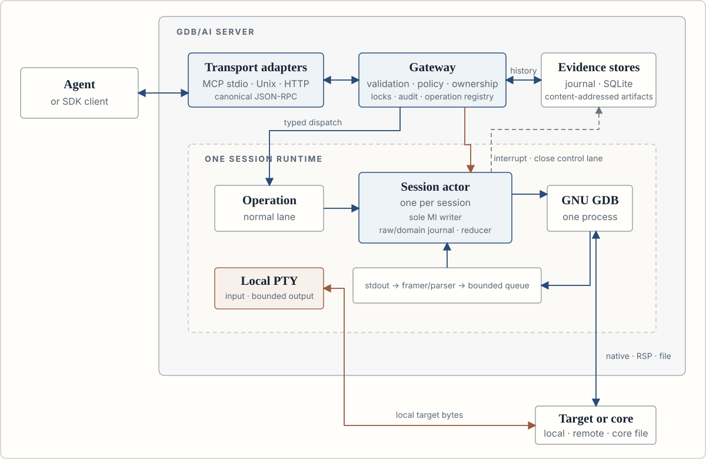
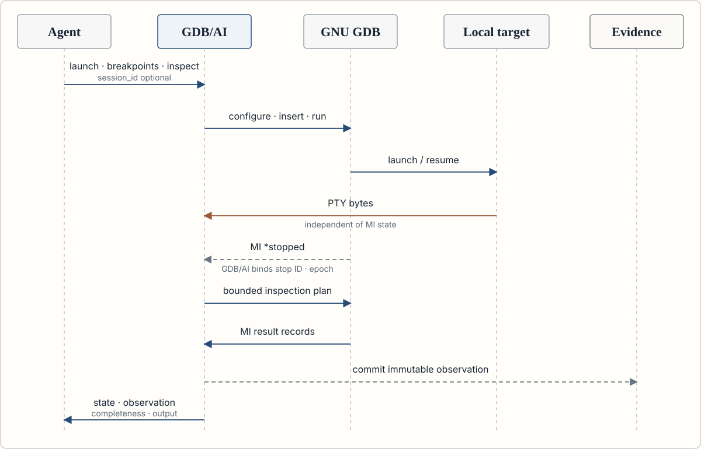

# GDB/AI

<p align="center">
  <a href="https://github.com/0wnerDied/GDB-AI/actions/workflows/ci.yml"></a>
  <a href="LICENSE"></a>
  
  
  
</p>

<p align="center">
  <strong>A stateful debugger control plane for modern Agents.</strong><br>
  Dynamic debugging · vulnerability validation · authorized exploit development
</p>

<p align="center">
  
</p>
<p align="center"><em>Figure 1. GDB/AI system architecture and isolated data paths.</em></p>

**GDB/AI (Agent Interface)** is a stateful interface for modern Agents doing
dynamic debugging, vulnerability validation, and authorized vulnerability
exploitation. It runs above GDB and the GDB/MI machine interface, exposing
bounded semantic operations through MCP and canonical JSON-RPC instead of
requiring Agents to manage debugger processes, parse terminal prompts, or
depend on implicit GDB context.

GDB/AI does not define or replace GDB/MI. GDB/MI is part of GNU GDB in the
binutils-gdb project and serves only as GDB/AI's backend protocol. Each GDB/AI
session runs one dedicated GDB process, separates inferior PTY traffic from
MI control traffic, and reduces asynchronous records into explicit state.

## How it works

<p align="center">
  
</p>
<p align="center"><em>Figure 2. A stop-producing operation and its evidence boundary.</em></p>

GDB/AI keeps GDB/MI as the backend boundary and takes over the stateful work
that every Agent frontend would otherwise need to implement:

| Concern | Frontend using GDB/MI directly | GDB/AI |
| --- | --- | --- |
| Lifecycle | Spawn, restart, interrupt, and clean up GDB | One owned GDB process per session |
| State | Correlate result and asynchronous records | Reducer-owned revisions, epochs, and stop IDs |
| Context | Track selected inferior, thread, and frame | Explicit, stale-checked handles |
| Target I/O | Configure and drain target streams | Dedicated bounded PTY and separate MI control |
| Large results | Add limits and storage per command | Pagination, quotas, and content-addressed artifacts |
| Safety | Build policy around every mutation | Profiles, leases, revisions, audit, and reconciliation |

The repository is independently versioned as `gdb-ai`; the executable is
`gdb-ai`, the current protocol namespace is `gdb.ai/v1`, and resources use
`gdbai://`.

## Verification status

Required CI builds the locked Rust workspace, runs Clippy, schemas, SDK tests,
bounded fuzz campaigns, and exercises checksum-pinned GDB 9.2-12.1 with MI3
plus GDB 13.2-17.2 with MI4. Target tests cover x86-64 and AArch64 user space,
local launch, attach, core files, gdbserver, remote RSP, noisy PTY traffic,
signals, and conditional Linux kernel inspection under QEMU.

See [compatibility](docs/compatibility.md) for the supported matrix and
[GitHub Actions](https://github.com/0wnerDied/GDB-AI/actions) for current test
results. Release artifacts identify the exact source tag and checksums they
qualify. Agent-effect comparisons are not part of the compatibility claim.

## Implemented system

- Bounded byte-stream MI4/MI3 framer, parser, encoder, lossless AST, saved
  fixtures, property-style chunk tests, and required cargo-fuzz campaigns
- One session actor and GDB child per session with token correlation,
  serialized commands, finite deadlines, cancellation, and interrupt support
- Journal-before-reducer state, revisions, execution epochs, stop IDs,
  stale-handle rejection, snapshots, tracked state, diffs, and replay
- Local launch, allowlisted PID attach, core files, allowlisted gdbserver/RSP,
  detach, restart, kill, fork/exec policy, and structured signal policy
- Structured breakpoints/watchpoints/catchpoints, threads, frames, locals,
  arguments, registers, variable objects, memory, disassembly, modules,
  mappings, source excerpts, and inferior I/O
- Compare-and-swap memory writes, register writes, bounded search, paged
  values, content-addressed artifacts, and owner-checked resource access
- Agent probes, experiments, hypothesis checks, observation budgets, tracked
  expressions/memory, crash signatures, and provider provenance
- Write leases, optimistic revisions, idempotency, profiles, rate limits,
  redacted SQLite audit, WAL metadata, JSONL evidence, and reconciliation
- MCP stdio, MCP Streamable HTTP, Unix socket, canonical JSON-RPC, Python SDK,
  TypeScript SDK, CLI operations, schema files, and Prometheus text metrics
- Secure GDB startup, clean or allowlisted inherited inferior environments,
  workspace path policy,
  bubblewrap filesystem/network hardening when available, `no_new_privs`, and
  process rlimits; untrusted targets require an external container or VM
- Optional SHA-256-pinned GDB Python MI extension and conditional kernel
  provider with bounded tasks/modules/panic context and an explicit monitor
  allowlist; see [Linux kernel debugging](docs/kernel.md)

Version 1 intentionally remains all-stop and Linux-only. It does not claim
non-stop execution, native Windows/macOS debugging, an LLDB backend, arbitrary
interactive CLI/Python/shell access, proprietary JTAG unification, or live
inferior restoration after GDB death.

## Requirements

- Linux and Rust 1.88 or newer
- GDB 13 or newer for MI4, or GDB 9 or newer for MI3 compatibility
- Bubblewrap for optional mount/network hardening (`auto` reports absence;
  `required` fails closed); it is not a complete untrusted-code sandbox
- A C compiler for integration tests
- Optional: gdbserver, Python-enabled GDB, Node.js 18 or newer
- AArch64 RSP integration: gdb-multiarch, qemu-user, and an AArch64 C compiler
- AArch64 system integration: Docker, qemu-system-aarch64,
  qemu-user-static, and the AArch64 Rust/GCC targets

## Build and verify

```sh
cargo build --locked --release
GDB_AI_REQUIRE_INTEGRATION=1 cargo test --locked --workspace --all-targets
cargo clippy --locked --workspace --all-targets -- -D warnings
cargo +1.88.0 check --locked --workspace --all-targets
cargo run -p gdb-ai -- doctor
```

Additional checks:

```sh
cargo check --manifest-path fuzz/Cargo.toml --bins
python3 -m compileall -q gdb-extension sdk/python benchmarks/python
npm --prefix sdk/typescript ci
npm --prefix sdk/typescript run build
(cd schemas && sha256sum -c SHA256SUMS)
```

## Serve MCP and JSON-RPC

Single-client stdio:

```sh
target/release/gdb-ai serve --stdio
```

The default MCP catalog is the bounded nine-tool Agent surface below. Use
`--advanced-tools` only when an Agent needs extended targets, mutations,
variable objects, tracking, batches, probes, or kernel operations. The full
canonical `gdb.ai/call` API remains available independently of MCP discovery.

Multi-client local socket:

```sh
target/release/gdb-ai serve --unix /run/user/1000/gdb-ai.sock
```

Streamable HTTP listens only on loopback. Use a private bearer-token file and
terminate remote TLS at a trusted same-host reverse proxy. Browser clients
also require an exact Origin allowlist entry:

```sh
target/release/gdb-ai serve --http 127.0.0.1:8080 \
  --auth-token-file /run/secrets/gdb-ai-token \
  --trusted-origin https://agent.example
```

HTTP endpoints are `/mcp`, `/healthz`, and `/metrics`. The same connection
accepts MCP tools and the canonical `gdb.ai/call` JSON-RPC method. Supported
Streamable HTTP uses MCP `2025-11-25`; every request after initialization must
carry that negotiated `Mcp-Protocol-Version`. Stdio and Unix streams retain
the tested message-level compatibility modes without claiming legacy HTTP+SSE.

## Tools

| Tool | Purpose |
| --- | --- |
| `gdb_session` | Sessions, leases, local launch, lifecycle, and capabilities |
| `gdb_run` | Continue, interrupt, source/instruction stepping, and waits |
| `gdb_breakpoints` | Breakpoints, watchpoints, catchpoints, conditions, and scopes |
| `gdb_inspect` | Bounded target, stack, variable, source, module, mapping, and snapshot views |
| `gdb_evaluate` | Side-effect-denied one-shot expression evaluation |
| `gdb_memory` | Bounded stop-consistent memory reads |
| `gdb_disassemble` | Normalized bounded instructions with source and bytes |
| `gdb_io` | Separate PTY, MI target, console, and log I/O plus `send_eof` and resize |
| `gdb_events` | Finite event waits |

`--advanced-tools` additionally projects `gdb_values`, `gdb_registers`,
`gdb_tracking`, `gdb_signals`, `gdb_batch`, `gdb_agent`, and `gdb_kernel`, plus
extended-target and mutation actions on the core tools. `gdb_agent` currently
projects only the stop-attributed bounded probe; experiment and hypothesis
aliases remain canonical-only. `gdb_raw` is registered separately only with
`--raw-admin`.

Mutations require both the exact current `expected_revision` and `lease_id`,
or an explicit `accept_latest_revision` where permitted. `session.create`
returns the first expiring lease. Renew it with
`session.acquire_write_lease`. Starting execution invalidates every previous
frame and value handle. If a lease expires while consistency is unknown or
lost, the owner can reacquire it, attempt recovery, or use `gdb_session`
action `force_abort` to terminate resources without claiming a clean shutdown.

## Configuration and SDKs

```sh
gdb-ai --config /absolute/path/to/gdb-ai.toml serve --stdio
```

See [gdb-ai.example.toml](gdb-ai.example.toml) and the hardened distribution
sample in [packaging/distro/gdb-ai.toml](packaging/distro/gdb-ai.toml).
Python and TypeScript clients live under [sdk](sdk). Static protocol schemas
and their SHA-256 hashes live under [schemas](schemas).

The optional extension at [gdb-extension/gdb_ai.py](gdb-extension/gdb_ai.py)
must be configured with an absolute path and its exact SHA-256 digest. It is
never auto-loaded from a target directory.

## Replay and operations

```sh
gdb-ai transcript export <session-id>
gdb-ai transcript inspect /path/to/journal.jsonl
gdb-ai replay /path/to/journal.jsonl --session-id sess_replay
gdb-ai session list
gdb-ai session inspect <session-id>
gdb-ai session close <session-id>
gdb-ai schema export
gdb-ai storage status
gdb-ai storage verify
gdb-ai storage gc
gdb-ai storage gc --execute
```

If a Streamable HTTP waiter expires, its error data includes an `operation_id`.
Use `gdb_session` action `operation_status` to retrieve the canonical outcome;
the timeout does not claim that the debugger operation was cancelled.
For a record whose `cancellation` is `ACTOR_SCOPED`, use action
`operation_cancel` with the same ID and mode `interrupt_target` or
`close_session`. A stale cancellation never controls a later target resume.

Session CLI commands connect to `server.unix_socket`. Replay validates strict
journal ordering and reconstructs controller state and stored snapshots. A
recorded `session.created` ID overrides `--session-id`; the flag supplies a
legacy MI-only fallback. Replay never executes or claims to restore an
inferior.

Storage GC is dry-run unless `--execute` is present. Status and GC never hash
all content; `storage verify` performs that explicit integrity scan. Daemon
and maintenance commands share one non-blocking data-directory lock, so GC
cannot race live artifact ownership changes. Invalid unknown directory entries
are reported and never removed automatically. Historical sessions and their
journals are also bounded by configured age and count retention.

## Embedding in binutils-gdb

```sh
git submodule add https://github.com/0wnerDied/GDB-AI.git gdb-ai
cargo build --manifest-path gdb-ai/Cargo.toml --release
```

No binutils-gdb source modification is required. GDB/AI controls the built or
installed `gdb` executable through GDB's existing GDB/MI machine interface.

## License

[GPL-3.0-or-later](LICENSE).

Architecture, protocol, operations, security, compatibility, and kernel
guides are available under [docs](docs). Contributor work is tracked in
[PLAN.md](PLAN.md).
